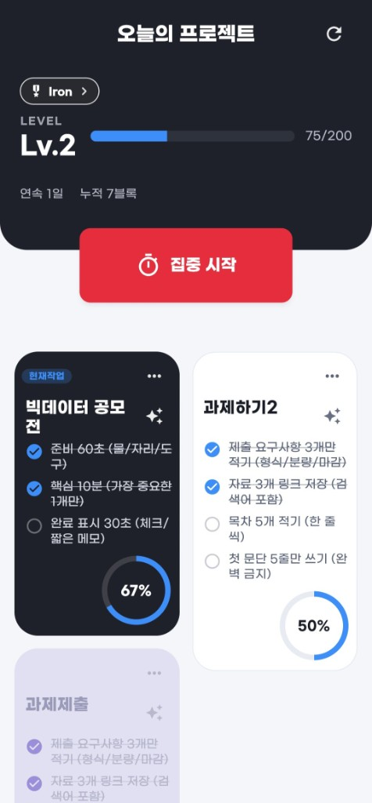
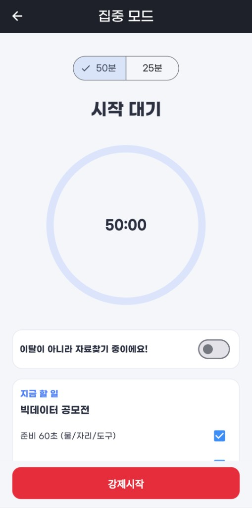
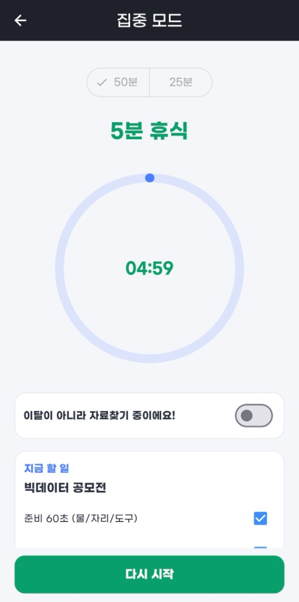
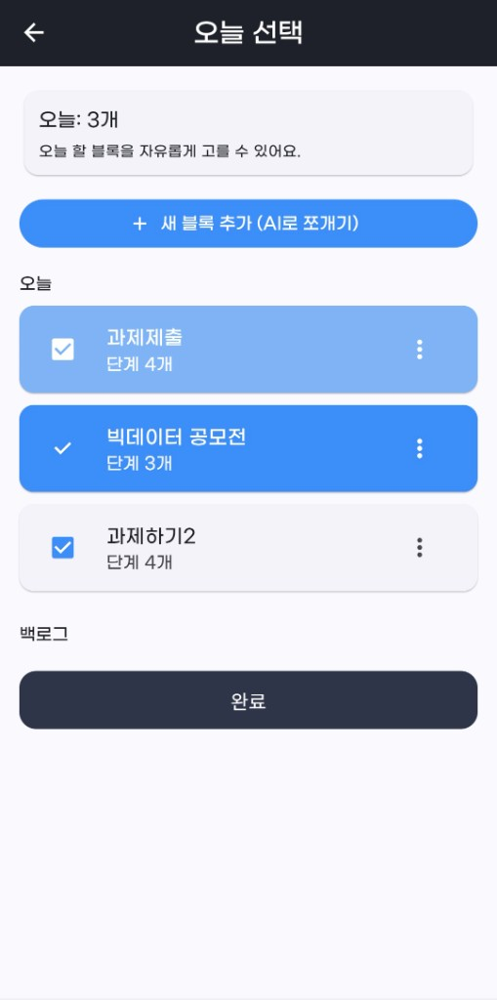
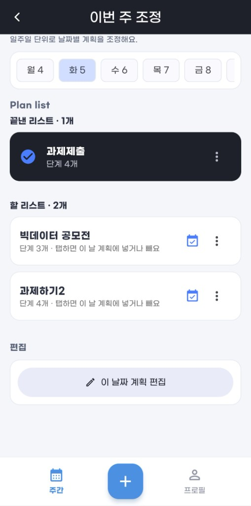
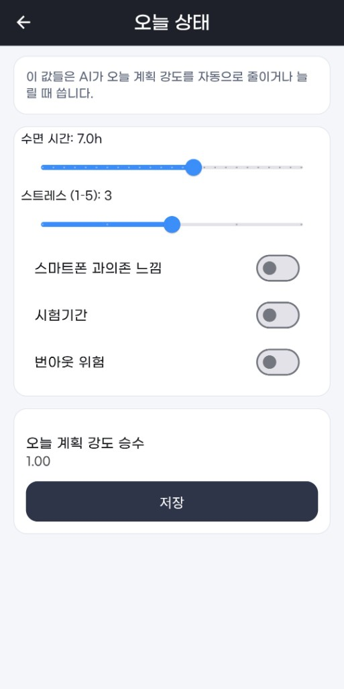
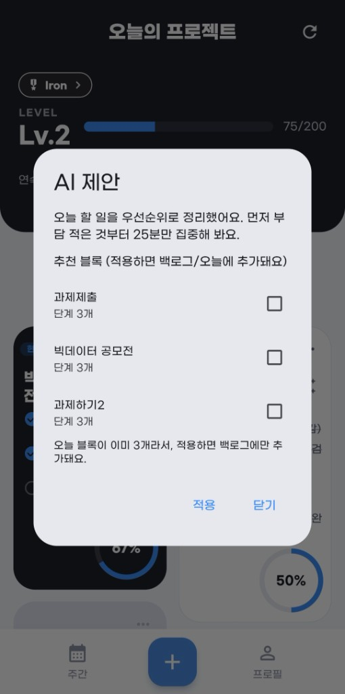
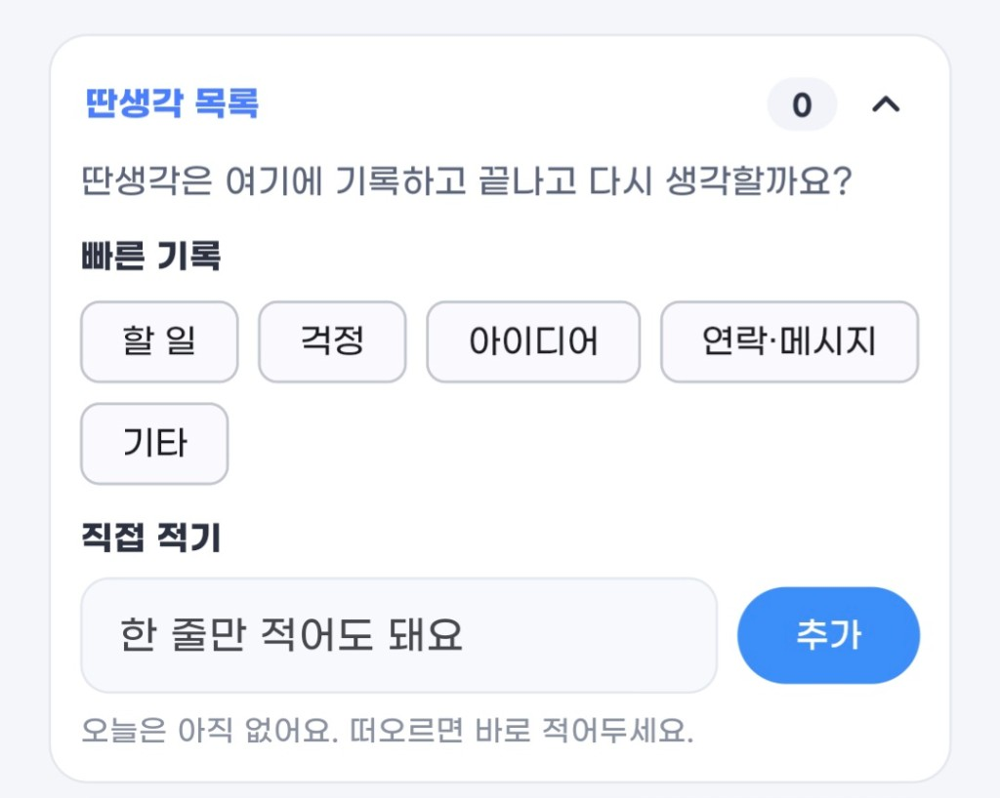
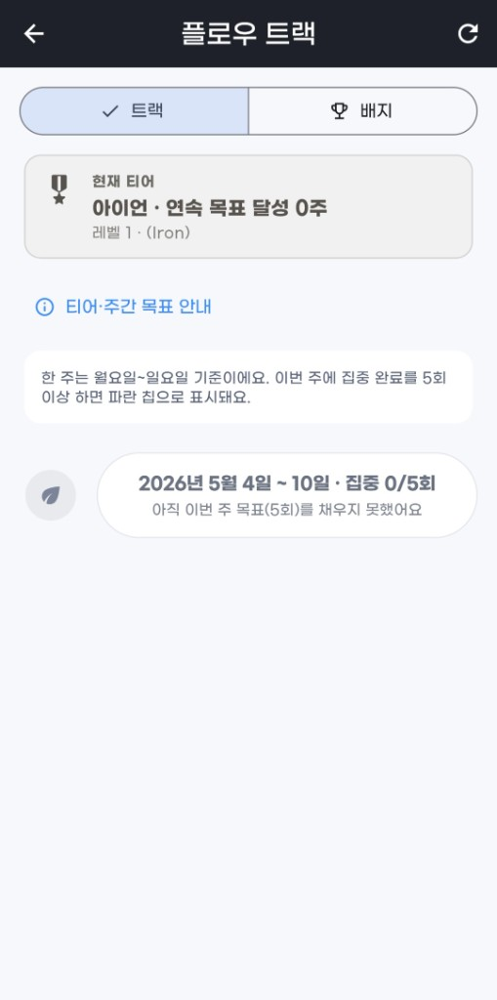
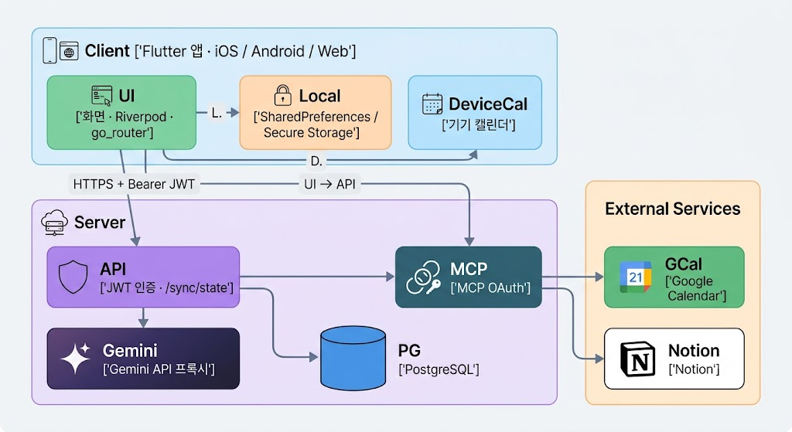

# FocusFlow

**신경다양성을 위한 AI 인지 보조 플랫폼** — 실행 기능을 넘어, 실제 행동을 만듭니다.

> 관리 도구는 넘치지만, 실행 도구는 없습니다.  
> FocusFlow는 계획만 쌓는 앱이 아니라 지금 바로 시작하게 만드는 ADHD 지향 실행 앱입니다.

## Table of Contents

- [프로젝트 소개](#프로젝트-소개)
- [주요 기능](#주요-기능)
- [팀 구성](#팀-구성)
- [시스템 아키텍처](#시스템-아키텍처)
- [기술 스택](#기술-스택)
- [상세 기능](#상세-기능)
- [프로젝트 구조](#프로젝트-구조)
- [로컬 실행](#로컬-실행)

## 프로젝트 소개

FocusFlow는 성인 ADHD와 “계획은 잘 세우지만 착수가 어려운” 사용자를 위한 **실행 보조 앱**입니다.

해야 할 일·공모전·과제·일정이 끝없이 쌓이면, 기존 할 일 앱은 목록만 늘리고 시작은 사용자에게 맡깁니다. 성인 ADHD의 핵심은 집중력 부족이 아니라 **실행 기능(Executive Function)의 결핍**입니다. FocusFlow는 이 지점을 제품의 중심으로 둡니다.

- 거대한 할 일은 AI가 **바로 할 수 있는 작은 단위**로 쪼갭니다.
- 하루에 고를 수 있는 블록은 **최대 3개**로 제한해 선택 과부하를 줄입니다.
- 작업 선택 후 **카운트다운 → 강제 착수**로 “나중에”를 끊습니다.
- 수면·스트레스 등 오늘 컨디션에 맞춰 **계획 강도를 자동으로 낮춥니다.**

전국민 AI 경진대회 AI 루키 트랙을 계기로 기획·구현되었습니다.

## 주요 기능

### 실행

- **강제 시작**: 3초 카운트다운 후 집중 세션에 바로 진입합니다. 50분 / 25분을 고를 수 있습니다.
- **Time Flow Ring**: 시간 흐름을 링으로 보여 시간 착각을 줄입니다.
- **딴생각 파킹랏**: 떠오른 생각은 적고 다시 원래 일로 돌아옵니다.
- **앱 이탈 감지**: 백그라운드 전환을 기록하고, 돌아오면 부드럽게 복귀를 유도합니다.
- **5분 휴식 / 5분 시작**: 번아웃이 보이면 짧게 쉬거나, “딱 5분만”으로 진입 장벽을 낮춥니다.

### 계획

- **하루 3블록 제한**: 과대 계획을 막고, 오늘 할 일만 고릅니다.
- **AI 태스크 원자화**: “방 청소”처럼 큰 일을 “바닥 옷 줍기” 수준의 체크리스트로 분해합니다.
- **주간 조정**: 요일별로 끝난 리스트와 할 리스트를 나눠 봅니다.
- **오늘 상태**: 수면, 스트레스, 시험기간 등을 입력하면 계획 강도 승수가 바뀝니다.

### AI · 외부 도구

- **오늘 계획 제안**: 목표·백로그·컨디션을 보고 우선순위와 추천 블록을 제안합니다.
- **MCP 연동**: Google Calendar, Notion, 기기 캘린더에서 할 일을 모아 오늘 계획으로 정리합니다.
- **코치 넛지**: 오늘 블록이 없거나 이탈이 쌓이면 AI 제안·5분 시작을 띄웁니다.
- **기록 요약**: 완료 블록, 시작 지연, 딴생각 횟수를 바탕으로 오늘을 한 문단으로 정리합니다.

### 보상

- **XP · 레벨 · 연속일**: 블록을 끝낼수록 레벨이 오르고 연속이 쌓입니다.
- **플로우 트랙**: 주 5회 집중 완료를 목표로 Iron → Mythic 티어가 올라갑니다.

<table>
  <tr>
    <td align="center" width="33%"><strong>오늘의 프로젝트</strong><br/></td>
    <td align="center" width="33%"><strong>집중 모드</strong><br/></td>
    <td align="center" width="33%"><strong>5분 휴식</strong><br/></td>
  </tr>
  <tr>
    <td align="center"><strong>오늘 선택</strong><br/></td>
    <td align="center"><strong>이번 주 조정</strong><br/></td>
    <td align="center"><strong>오늘 상태</strong><br/></td>
  </tr>
  <tr>
    <td align="center"><strong>AI 제안</strong><br/></td>
    <td align="center"><strong>딴생각 목록</strong><br/></td>
    <td align="center"><strong>플로우 트랙</strong><br/></td>
  </tr>
</table>

## 팀 구성

| 기획 | 개발 |
| :---: | :---: |
| **문지용** | **신수민** |
| ADHD 리서치 · 문제 정의 · 스토리텔링 · 비즈니스 로직 | UX 프레임워크 · Flutter 앱 · Node.js / Gemini 아키텍처 |

## 시스템 아키텍처

<p align="center">
  
</p>

- **클라이언트**: 할 일·집중 로그·레벨은 기기 로컬에 저장하고, 로그인 시 서버 JSON 페이로드로 동기화합니다.
- **서버**: 계정(이메일/비밀번호), 닉네임, 동기화 상태, Gemini 호출, Calendar/Notion OAuth를 담당합니다. Gemini 키는 서버에만 둡니다.
- **배포**: API와 PostgreSQL은 Render, Flutter 웹은 Netlify(`scripts/netlify-build.sh`).
- **AI 폴백**: 서버 Gemini가 없거나 실패하면 앱의 규칙 기반 Mock 에이전트가 같은 인터페이스로 제안합니다. 클라이언트에 `OPENAI_API_KEY`를 넣으면 GPT 경로도 사용할 수 있습니다.

## 기술 스택

### Frontend


- 상태 관리: `flutter_riverpod`
- 라우팅: `go_router` (인증·온보딩·오늘 상태 게이트)
- 로컬 저장: `shared_preferences`, `flutter_secure_storage`
- 알림: `flutter_local_notifications`, `timezone`
- 기타: `http`, `uuid`, `device_calendar`, `url_launcher`, `flutter_staggered_grid_view`

### Backend


- 인증: JWT (`jsonwebtoken`) + `bcryptjs`
- DB: PostgreSQL (`pg`), Render Postgres
- AI: Google Gemini (`gemini-1.5-flash`, 환경변수로 모델 변경)
- 연동: Google Calendar OAuth, Notion OAuth
- 미들웨어: `dotenv`, `cors`

### Deployment


## 상세 기능

기존 ADHD·할 일 앱이 자주 놓치는 여섯 가지 약점에 맞춰 기능을 설계했습니다.

| 약점 | FocusFlow의 대응 |
| --- | --- |
| 시작 회피 | 3초 카운트다운 후 강제 착수, 저에너지일 때 “딱 5분만” |
| 과대 계획 | 하루 선택 블록 최대 3개 |
| 시간 착각 | Time Flow Ring으로 남은 시간을 시각화 |
| 과부하 | AI가 2~4개의 작은 실행 단위로 분해, 첫 단계는 수 분 안에 끝나게 |
| 산만 | 앱 이탈 기록, 딴생각 파킹, 자료 찾기 토글(이탈로 치지 않음) |
| 번아웃 | 오늘 상태 → 계획 강도 승수, 집중 중 5분 휴식 |

### AI 태스크 원자화

큰 일을 보면 멈추는 **Freeze**를 줄이기 위해, 블록을 바로 체크할 수 있는 단위로 쪼갭니다.

- 새 블록 추가 시 AI가 단계를 제안하거나, 기본값으로 `준비 60초 / 핵심 10분 / 마무리`를 넣습니다.
- 컨디션이 나쁘면 첫 단계를 더 작게 잡도록 프롬프트가 조정됩니다.
- 하루에 고른 블록이 이미 3개면, AI 제안은 **백로그에만** 들어갑니다.

### 강제 시작 · Time Flow · Recovery

작업만 고르고 고민하는 시간을 앱이 끊습니다.

- **강제 시작**: 대기 화면에서 바로 카운트다운 → 집중.
- **50분 / 25분**: 세션 길이만 고르고, 진행 중에는 링이 차오릅니다.
- **자료 찾기 토글**: 과제용 검색은 이탈이 아니라고 스스로 표시할 수 있습니다.
- **5분 휴식**: 집중 타이머는 유지한 채 안쪽만 휴식 카운트다운(Recovery Mode).

### 딴생각 파킹랏 (Later List)

집중 중에 떠오른 할 일·걱정·아이디어는 적고 원래 작업으로 돌아옵니다. 파킹된 항목은 이탈 횟수·코치 신호에는 넣지 않습니다.

빠른 태그: 할 일, 걱정, 아이디어, 연락·메시지, 기타.

### 오늘 상태 → 계획 강도

매일 첫 진입 시 오늘 상태를 저장합니다. AI는 이 값을 보고 오늘 할 일의 양과 개입 강도를 조절합니다.

- 수면 시간, 스트레스(1–5)
- 스마트폰 과의존, 시험기간, 번아웃 위험
- **계획 강도 승수** (대략 0.5 ~ 1.5): 수면이 적거나 스트레스가 높으면 오늘 계획을 줄입니다.

### 오늘 선택 · 주간 조정

하단 탭은 **주간 / + (오늘 선택) / 프로필**입니다.

- **오늘 선택**: 오늘 3개까지 고르고, AI로 새 블록을 쪼개 추가합니다.
- **이번 주 조정**: 월~금 날짜를 고르면 끝난 리스트와 할 리스트가 나뉩니다. 탭하면 그 날 계획에 넣거나 뺍니다.

### 플로우 트랙 · 도파민 보상

즉각 보상이 없으면 동기가 급격히 떨어집니다. 완료할 때마다 XP가 쌓이고, 주 단위로는 티어가 움직입니다.

- 레벨: 필요 XP = `level × 100`
- 배지: 첫 블록 완료, 3일/7일 연속, 레벨 5
- 플로우 트랙: 한 주는 월요일~일요일, 집중 완료 5회면 파란 칩. 티어는 Iron → Bronze → Silver → Gold → Platinum → Sapphire → Ruby → Diamond → Mythic

### 기록 / 통계

집중 로그를 바탕으로 오늘을 요약합니다.

- 오늘 완료 블록 수
- 시작 지연, 이탈·딴생각 횟수
- AI가 생성한 한 줄 코칭 (예: 내일은 블록을 더 짧게)

### 외부 도구 연결 (MCP)

흩어진 할 일을 다시 옮기는 비용을 줄입니다.

- Google Calendar, Notion OAuth
- 기기 캘린더(삼성 캘린더 포함)는 앱에서 직접 읽습니다
- 가져온 항목을 Gemini가 **오늘 최대 3블록, 블록당 2~5 작은 단위**로 재구성합니다

### 인증 · 동기화

- 이메일/비밀번호 가입·로그인, 닉네임
- JWT는 앱 시크릿 스토리지에 보관
- 로그인 사용자별로 로컬 키를 나눠, 계정 데이터가 섞이지 않게 합니다
- `/sync/state`로 블록·집중 로그·레벨·목표를 JSON으로 pull/push합니다. 서버가 비어 있고 기기에만 데이터가 있으면 로컬을 올립니다

## 프로젝트 구조

```text
FocusFlow/
├─ lib/
│  ├─ main.dart
│  ├─ app/                         # 테마, 루트 위젯, go_router
│  ├─ core/                        # API URL, 하루 3블록 상수, 타임존, 유저별 로컬 키
│  └─ features/
│     ├─ auth/                     # 로그인 · 회원가입 · 토큰
│     ├─ onboarding/               # 첫 실행 온보딩
│     ├─ home/                     # 오늘의 프로젝트
│     ├─ planning/                 # 블록 · 오늘 선택 · 주간 조정
│     ├─ focus_session/            # 집중 타이머 · 파킹랏 · 이탈 로그
│     ├─ user_state/               # 오늘 상태 · 계획 강도
│     ├─ ai_agent/                 # 계획 제안 · 분해 · 요약 (Gemini/OpenAI/Mock)
│     ├─ mcp/                      # Calendar / Notion / 기기 캘린더
│     ├─ coach/                    # 상황별 넛지
│     ├─ flow_track/               # 주간 티어 트랙
│     ├─ gamification/             # XP · 레벨 · 배지
│     ├─ insights/                 # 기록/통계
│     ├─ goals/                    # 목표
│     ├─ notifications/            # 로컬 리마인더
│     ├─ profile/                  # 계정 · 기능 허브
│     └─ sync/                     # 서버 ↔ 로컬 동기화
├─ server/
│  └─ src/
│     ├─ index.js                  # 인증, sync, Gemini 프록시
│     ├─ gemini.js
│     └─ mcp/                      # Google Calendar · Notion OAuth
├─ docs/images/                    # README 스크린샷
├─ render.yaml                     # Render 웹 서비스
└─ netlify.toml                    # Flutter web 배포
```

## 로컬 실행

### 앱

```bash
flutter pub get
flutter run --dart-define=API_BASE_URL=https://your-api.example.com
```

`API_BASE_URL`이 없으면 인증 없이 **로컬 전용 모드**로 동작합니다.

### API

```bash
cd server
npm install
# DATABASE_URL, JWT_SECRET 필수. GEMINI_API_KEY · OAuth 클라이언트는 선택.
npm start
```

Render 블루프린트는 `render.yaml`을 참고하세요. Flutter 웹 빌드는 Netlify에서 `scripts/netlify-build.sh`로 수행합니다.
